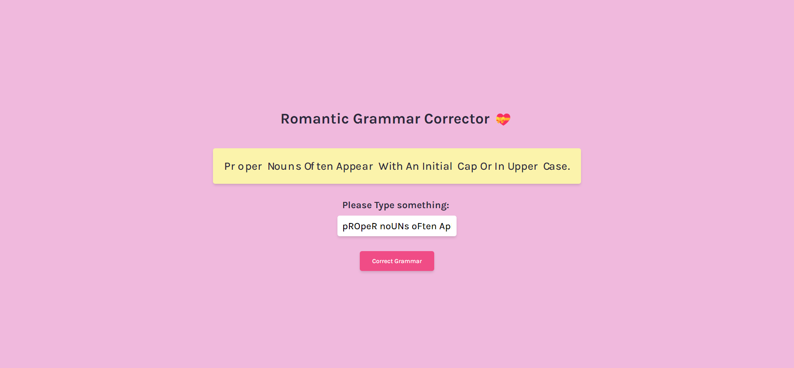
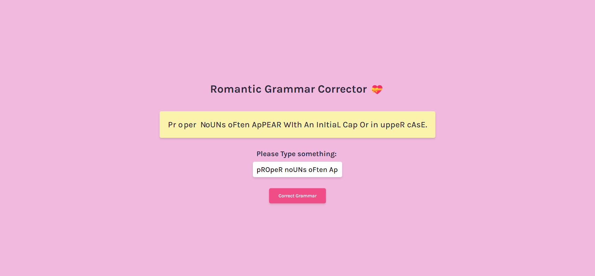
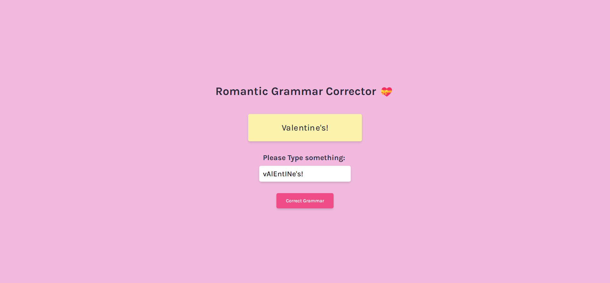

# Frontend Mentor - Profile card component solution

This is a solution to the [Valentine's Challenge](https://scrimba.com/learn/codeweeks/-valentines-greeting-challenge-co62942e9aa8970a7028de53d). 

## Table of contents

- [Overview](#overview)
  - [Screenshot](#screenshot)
  - [Links](#links)
- [My process](#my-process)
  - [Built with](#built-with)
  - [What I learned](#what-i-learned)
  - [Continued development](#continued-development)
  - [Useful resources](#useful-resources)
- [Author](#author)
- [Acknowledgments](#acknowledgments)

## Overview

This is my solution to the Valentine's Challenge for the 15th of January, 2022.
It is a small project that interacts with the users to display a valentines
greeting with 3 optional input, a sender, recipient and a message from the
selected options or the user can input a custom message. As an added element, I
added a button to the custom input that if the user presses the button it will
randomly choose a valentines joke as the input.

### Screenshot






### Links

- Solution URL: [GitHub](https://github.com/newbpydev/valentines-15-2022)
- Live Site URL: [Live Site](https://distracted-goldwasser-763af5.netlify.app/)

## My process

### Built with

- Semantic HTML5 markup
- CSS custom properties
- Flexbox
- Javasript

### What I learned

I have learned on this project how to get instant input feedback based on what
the user types. It is a nice feature to keep in mind while building my own apps.

```javascript
const getRandJoke = () => {
  const randIndex = Math.floor(Math.random() * randValentinesJoke.length);
  return randValentinesJoke[randIndex];
}
// getRandJoke();

customEl.addEventListener("input", () => {
  msgObject["msg"] = customEl.value;
  writeGreeting();
});

btnJokeEl.addEventListener("click", () => {
  msgObject["msg"] = getRandJoke();
  customEl.value = msgObject['msg'];
  writeGreeting();
```

### Continued development

For future development, I will continue to use expore the js Dom to manipulate
the elements on my pages.

### Useful resources

- [OWASP Cross Site Scripting Prevention](https://cheatsheetseries.owasp.org/cheatsheets/Cross_Site_Scripting_Prevention_Cheat_Sheet.html) - This article provides a simple positive model for preventing XSS using output encoding properly. While there are a huge number of XSS attack vectors, following a few simple rules can completely defend against this serious attack.
- [YouTube - RegEx](https://www.youtube.com/watch?v=rhzKDrUiJVk&t=1029s&ab_channel=WebDevSimplified) - Having the ability to search through text, validate text, and replace text using an advanced set of rules is exactly what Regex is for. Unfortunately, people fail to ever truly learn Regex. In this video I will be teaching you everything you need to know about Regex. We will talk about what Regex is, what Regex flags are, how to do simple and complex matches, how to handle look aheads and look behinds, and much more. Then at the end of the video I will show you how to use Regex to validate and format a phone number in various different formats.

## Author

- Website - [Juan Gomez](https://www.newbpydev.com)
- Frontend Mentor - [@newbpydev](https://www.frontendmentor.io/profile/newbpydev)
- Twitter - [@Newb_PyDev](https://twitter.com/Newb_PyDev)

## Acknowledgments

The code may not be perfect compared to my sensei @jonasschmedtman but I need
to thank him because he has shown me the ropes and now I am a confident web
designer.


